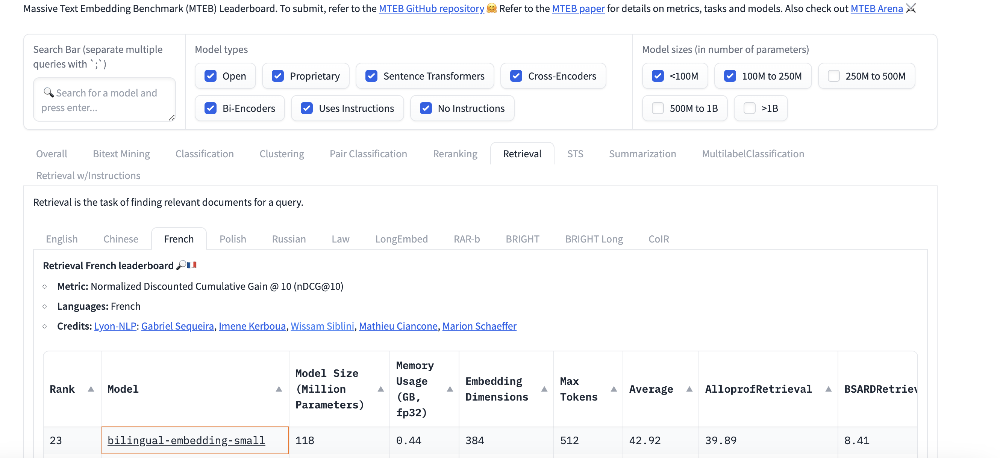
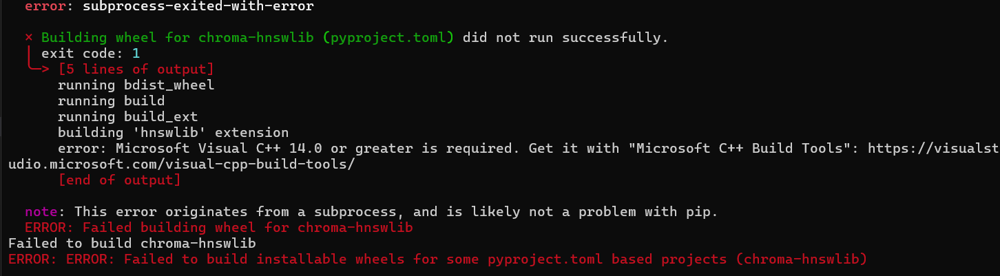
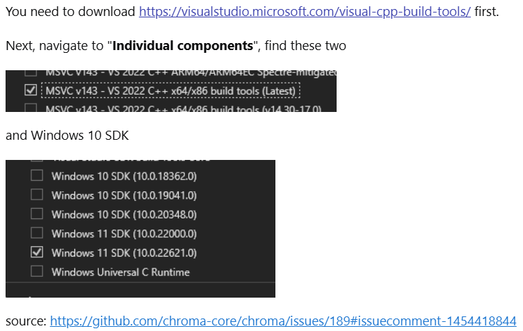

<div align="center">
	
</div>

## Choix des Modèles et des Technologies

### Modèle d'Embedding


Pour mon système de récupération de l'information, j'ai opté pour le modèle `Lajavaness/bilingual-embedding-small`. Ce choix est justifié par plusieurs facteurs clés :

1. **Performance** : Le modèle se classe 23ème sur le leaderboard Massive Text Embedding Benchmark (MTEB) pour la récupération en français. Cette position témoigne de son efficacité à générer des embeddings pertinents pour des tâches de recherche de texte.

2. **Taille** : Avec moins de 250 millions de paramètres, `Lajavaness/bilingual-embedding-small` est le modèle le plus performant en termes de taille sur le leaderboard. Cela le rend particulièrement adapté pour une utilisation locale, car il nécessite moins de ressources computationnelles et peut être déployé sur des machines avec des capacités limitées.

3. **Bilinguisme** : Ce modèle est conçu pour travailler efficacement avec des données en français, ce qui est essentiel pour le projet qui cible principalement ce langage.

### Base de Données Vectorielle

<div align="center">

</div>

Pour le stockage et la gestion des embeddings, j'ai choisi **ChromaDB** pour les raisons suivantes :

- **Facilité d'utilisation** : ChromaDB offre une interface conviviale qui simplifie le processus d'intégration dans mon application.
  
- **Gratuité** : En tant que solution open-source, ChromaDB ne génère pas de coûts supplémentaires, ce qui est idéal pour le développement local.

- **Adapté à une utilisation locale** : ChromaDB est conçu pour fonctionner efficacement sur des environnements de développement locaux, permettant ainsi une expérience de développement fluide sans nécessiter d'infrastructure complexe.

### Fonctionnement du Système RAG avec l'Assistant Vocal (Mise à jour)

Le système RAG (Retrieval-Augmented Generation) dans l'assistant vocal suit désormais ce flux pour traiter les requêtes de l'utilisateur :

1. **Entrée de la Requête (Voix)** : L'utilisateur énonce sa requête via l'assistant vocal.

2. **Transcription (Voix en Texte)** : La requête vocale est convertie en texte grâce à Deepgram, qui fournit la transcription.

3. **Prétraitement de la Question** : Le texte est ensuite soumis à un LLM (Langage Large Modèle), ici **Gemini**, qui corrige la question afin de la rendre exploitable pour la recherche.

4. **Recherche de Similarité** : Le système interroge la base de données vectorielle (gérée avec ChromaDB) pour trouver les questions les plus similaires en utilisant des embeddings générés par le modèle `Lajavaness/bilingual-embedding-small`.

5. **Validation de la Similarité** : Un prompt dédié vérifie la similitude entre la question corrigée et celle extraite de la base. Si la correspondance n'est pas suffisante, le système indique que la question n'est pas dans la base.

6. **Récupération et Préparation du Contexte** : Si la question est présente, le contexte correspondant est récupéré et corrigé via un prompt dédié au LLM pour assurer sa pertinence.

7. **Génération de la Réponse** : Le contexte corrigé est ensuite utilisé par le LLM pour générer une réponse, en fonction des règles fournies par les prompts RAG.

8. **Synthèse Vocale (TTS)** : La réponse textuelle est convertie en voix via un système de synthèse vocale, et l'utilisateur reçoit la réponse.

9. **Fin de la Session** : L'assistant vocal continue de fonctionner jusqu'à ce que l'utilisateur prononce "stop", moment auquel il se termine.

<div align="center">

</div>

---

## Instructions d'Utilisation

Pour utiliser ce projet, suivez les étapes ci-dessous :

### 1. Cloner le Dépôt

Ouvrez un terminal et exécutez la commande suivante pour cloner le dépôt :

```bash
git clone https://github.com/SadokBarbouche/Plug-Tel_TechnicalTest
```

### 2. Accéder au Dossier du Projet

Naviguez dans le dossier du projet :

```bash
cd Plug-Tel_TechnicalTest
```

### 3. Créer un Environnement Virtuel

Créez un environnement virtuel pour le projet :

```bash
python -m venv venv
```

### 4. Activer l'Environnement Virtuel

- **Sur macOS/Linux** :

```bash
source venv/bin/activate
```

- **Sur Windows** :

```bash
venv\Scripts\activate
```

### 5. Installer les Dépendances

Installez ensuite les dépendances requises en exécutant la commande suivante :

```bash
pip install -r requirements.txt
```

Si vous êtes sur Windows, vous pourriez rencontrer une erreur lors de l'installation de Chroma. 

<div align="center">

</div>


Voici un lien vers la solution: [Erreur d'installation de Chroma](https://stackoverflow.com/questions/73969269/error-could-not-build-wheels-for-hnswlib-which-is-required-to-install-pyprojec/76245995#76245995).

<div align="center">

</div>

Puis essayer de réexecuter :
```bash
pip install -r requirements.txt
```
Le problème doit disparaître.

### 6. Lancer l'Application

Après avoir installé les dépendances, vous pouvez lancer l'application avec la commande suivante :

```bash
python main.py
```
NB : Le projet nécessite une `DEEPGRAM_API_KEY` et une `GOOGLE_API_KEY` dans votre fichier `.env`.

---

### Détails du Refactoring et du Prototype

J'ai effectué un refactoring du code, notamment en le divisant en plusieurs modules. Des changements ont été apportés au niveau de l'assistant vocal, car je ne dispose pas de clé OpenAI ChatGPT. Veuillez noter que la gestion des interactions entre l'utilisateur et l'assistant vocal est encore en phase de prototype, donc les interactions ne sont pas totalement optimisées pour le moment.

Cependant, vous pouvez déjà interagir avec l'assistant vocal sur des données du dataset `sujet-ai/Sujet-Financial-RAG-FR-Dataset`. Toute question en dehors des données de la base n'est pas acceptable comme cela est demandé.

À noter également que **Deepgram** n'est pas très performant pour la reconnaissance des **noms propres**, ce qui pourrait influencer la qualité des transcriptions dans certains cas.